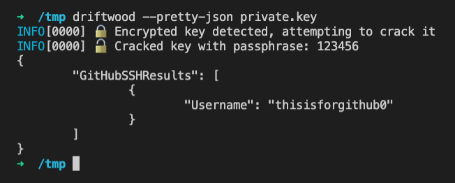

# Driftwood

## ⚠️ The Driftwood CLI tool is no longer supported. Please use [TruffleHog](https://github.com/trufflesecurity/trufflehog) instead! ⚠️

[](https://github.com/trufflesecurity/driftwood/actions)
[](https://goreportcard.com/report/github.com/trufflesecurity/driftwood)
[](https://hub.docker.com/r/trufflesecurity/driftwood/)


Driftwood is a tool that can enable you to lookup whether a private key is used for things like TLS or as a GitHub SSH key for a user. 

Driftwood performs lookups with the computed public key, so the private key never leaves where you run the tool. Additionally it supports some basic password cracking for encrypted keys.

You can read more on it [here](https://trufflesecurity.com/blog/driftwood-know-if-private-keys-are-sensitive/)



## Installation

Three easy ways to get started.

### Run with Docker

```bash
cat private.key | docker run --rm -i trufflesecurity/driftwood --pretty-json -
```

### Run pre-built binary
Download the binary from the [releases page](https://github.com/trufflesecurity/driftwood/releases) and run it. 

### Build yourself

```bash
go install github.com/trufflesecurity/driftwood@latest
```

## Usage

Minimal usage is

```bash
$ driftwood path/to/privatekey.pem
```

Run with `--help` to see more options.

## Library Usage

Packages under `pkg/` are libraries that can be used for external consumption. Packages under `pkg/exp/` are considered to be experimental status and may have breaking changes.
